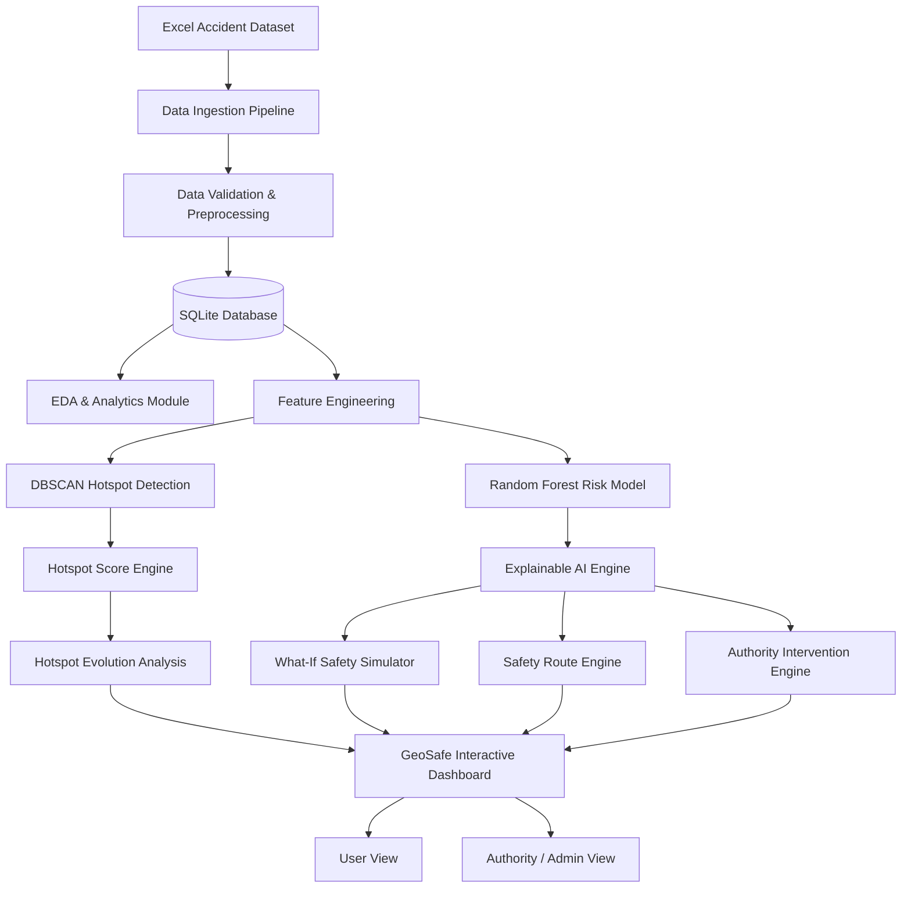

# GeoSafe: An Explainable Spatiotemporal AI System for Road Accident Hotspot Prediction and Safety-Aware Route Optimization

GeoSafe is a full-stack Data Science, GIS, and Spatiotemporal AI platform designed for road safety intelligence, initially focused on Chennai. The system combines historical accident analytics, DBSCAN spatial hotspot clustering, Random Forest predictive risk modeling, Explainable AI (XAI) feature attribution, interactive What-If scenario simulation, Safety-Aware Route Optimization, and Authority Intervention Recommendations.

---

## 1. Problem Statement

Road traffic accidents result in severe loss of life, injury, and economic damage. Traditional road safety and navigation systems suffer from key limitations:
1. **Reactive Focus**: They only highlight where accidents have *already* occurred, failing to predict future high-risk spatio-temporal conditions.
2. **Black-Box Scoring**: Machine learning risk scores lack transparent explanations showing *why* a location or scenario receives a high risk rating.
3. **Time-Only Navigation**: Standard navigation engines optimize purely for the fastest route, ignoring safety exposure and hotspot crossings.
4. **Lack of Decision Support for Authorities**: Navigation apps cater to drivers, failing to provide actionable engineering recommendations for municipal authorities.

---

## 2. System Objectives

- **Spatial Hotspot Detection**: Identify persistent and emerging accident hotspots using DBSCAN spatial clustering.
- **Predictive Risk Modeling**: Predict road risk scores and discrete risk levels based on spatio-temporal and environmental context.
- **Explainable AI (XAI)**: Provide local feature attribution breakdowns showing exact percentage contributions for every risk prediction.
- **What-If Safety Simulation**: Evaluate how risk scores change when conditions (traffic, weather, construction, speed limits) are adjusted.
- **Safety-Aware Route Optimization**: Compare **Fastest**, **Balanced**, and **Safest** routes based on candidate spatial paths and risk exposure formulas.
- **Authority Intervention Intelligence**: Recommend prioritized, rule-based safety infrastructure improvements for urban planners.

---

## 3. Core System Novelty (Five Pillars)

1. **NOVELTY 1: Predictive Hotspots**: Predicts future road risk based on context (time, weather, traffic, speed limits, construction) rather than relying exclusively on past incident locations.
2. **NOVELTY 2: Explainable AI (XAI)**: Quantifies feature importances as percentage attributions (e.g. Heavy Traffic 31%, Night Time 18%) for transparent risk interpretation.
3. **NOVELTY 3: What-If Safety Simulator**: Interactive scenario tester computing real-time risk score deltas when contextual conditions change.
4. **NOVELTY 4: Safety-Aware Routing**: Evaluates candidate paths comparing Fastest, Balanced, and Safest routes to minimize hotspot exposure.
5. **NOVELTY 5: Authority Intervention Intelligence**: Generates prioritized engineering recommendations (lighting, speed calming, signal timing optimization, anti-skid resurfacing) for civic authorities.

---

## 4. System Architecture



---

## 5. Technology Stack

- **Frontend**: Vite + React 18 + TypeScript + Tailwind CSS + Recharts + Leaflet / React-Leaflet + Lucide Icons
- **Backend API**: Python 3.12 + FastAPI + Pydantic v2 + SQLAlchemy ORM + Uvicorn
- **Database**: Local SQLite (`geosafe.db`)
- **Data Science & ML**: Pandas, NumPy, Scikit-learn (DBSCAN & Random Forest), openpyxl, joblib
- **Testing**: Pytest & FastAPI TestClient

---

## 6. Project Structure

```
/GEOSAFE
├── data/
│   └── GeoSafe_Chennai_Synthetic_Dataset.xlsx
├── backend/
│   ├── main.py
│   ├── database.py
│   ├── models.py
│   ├── schemas.py
│   ├── config.py
│   ├── routers/
│   │   ├── auth.py
│   │   ├── accidents.py
│   │   ├── hotspots.py
│   │   ├── risk.py
│   │   ├── routes.py
│   │   ├── simulation.py
│   │   ├── analytics.py
│   │   ├── interventions.py
│   │   ├── dashboard.py
│   │   └── ml.py
│   ├── services/
│   │   ├── preprocessing.py
│   │   ├── eda.py
│   │   ├── hotspot_detection.py
│   │   ├── risk_prediction.py
│   │   ├── explainability.py
│   │   ├── route_engine.py
│   │   ├── intervention_engine.py
│   │   └── forecasting.py
│   ├── ml/
│   │   ├── train.py
│   │   └── predict.py
│   └── utils/
│       ├── data_loader.py
│       └── validators.py
├── frontend/
│   ├── src/
│   │   ├── components/
│   │   ├── pages/
│   │   ├── services/
│   │   └── types/
│   ├── index.html
│   ├── package.json
│   └── vite.config.ts
├── models/
│   ├── risk_rf_clf.pkl
│   ├── risk_rf_reg.pkl
│   ├── scaler.pkl
│   └── ml_metrics.json
├── scripts/
│   ├── setup.py
├── docs/
│   ├── architecture.md
│   ├── data_dictionary.md
│   ├── ml_methodology.md
│   ├── api_documentation.md
│   └── setup_guide.md
├── tests/
│   └── test_api.py
├── requirements.txt
├── README.md
├── run_backend.bat
└── run_frontend.bat
```

---

## 7. Dataset Description

The system ingests the primary dataset `GeoSafe_Chennai_Synthetic_Dataset.xlsx` (10,000 records, 21 columns) into SQLite.

> [!NOTE]
> **Dataset Disclaimer**: The dataset is synthetic/semi-synthetic, designed to demonstrate the methodology, spatiotemporal algorithms, and decision-support framework. It should not be interpreted as authoritative real-world accident prediction validation.

---

## 8. Installation & Setup

### Automatic One-Command Setup

Run the setup script:

```bash
python scripts/setup.py
```

### Running Backend & Frontend

**Windows Batch Scripts**:
- Double click `run_backend.bat` or run:
  ```cmd
  python -m uvicorn backend.main:app --reload --host 127.0.0.1 --port 8000
  ```
- Double click `run_frontend.bat` or run:
  ```cmd
  cd frontend && npm run dev
  ```

**URLs**:
- **Frontend App**: `http://localhost:5173`
- **Backend API**: `http://127.0.0.1:8000`
- **Swagger Docs**: `http://127.0.0.1:8000/docs`

---

## 9. Demo Login Credentials

- **Authority Admin**: `admin@geosafe.local` / `admin123`
- **Standard User**: `user@geosafe.local` / `user123`

---

## 10. Offline Operation & Zero External API Guarantee

GeoSafe operates **100% locally** without requiring:
- No Google Maps API
- No Mapbox API
- No OpenWeather API
- No Firebase / Supabase
- No Docker container requirements
- No Cloud subscriptions

The interactive map includes an **Offline Canvas Mode** utilizing standalone SVG/GeoJSON representations of Chennai corridors, guaranteeing complete functionality when offline.

---

## 11. Automated Testing

Run the automated backend test suite:

```bash
python -m pytest tests/test_api.py
```

---

## 12. Academic Disclaimer & Limitations

> [!IMPORTANT]
> **Academic Disclaimer**: GeoSafe is an academic decision-support prototype. Its predictions, risk scores, and routes are based on the synthetic dataset provided and should not be used as official navigation or emergency response instructions.

### Limitations:
- Simplified offline road network graph based on dataset road segments.
- Model performance metrics reflect evaluation on synthetic data distribution.

### Future Enhancements:
- Integration with live government accident reporting systems.
- High-density OSM road network graph integration.
- Real-time weather and traffic sensor data ingestion.

## 13. Steps to Run

### First-Time Setup

```cmd
cd C:\path\to\GEOSAFE
python -m venv venv
venv\Scripts\activate
pip install -r requirements.txt
python scripts/setup.py
```

### Terminal 1 — Backend

```cmd
cd C:\path\to\GEOSAFE
venv\Scripts\activate
python -m uvicorn backend.main:app --reload --host 127.0.0.1 --port 8000
```

### Terminal 2 — Frontend

```cmd
cd C:\path\to\GEOSAFE\frontend
npm install
npm run dev
```

### URLs

```text
http://localhost:5173
http://127.0.0.1:8000/docs
```

### Tests

```cmd
cd C:\path\to\GEOSAFE
venv\Scripts\activate
python -m pytest tests/test_api.py
```
